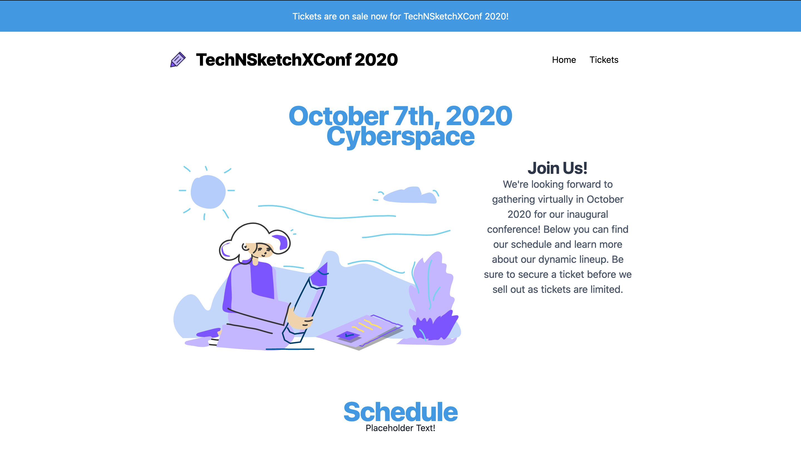

# 05 • Add site-wide banner
## Background 📚
A convention in React applications that have shared layouts across different pages is to have a Layout component that is imported into other Page level components and wrap their contents. The Layout component can be used to render elements like a header, navigation, footer, sidebar, etc. In particular the Layout component uses the `children` property from props to render all of the content within the component that is using the Layout component. You can read more about various approaches to creating Layout components in the Gatsby documentation: https://www.gatsbyjs.com/docs/layout-components/ 
 
A sample Layout component: 
```
import React from "react";
import Header from "./header";
import Footer from "./footer";
function Layout({ children }) {
 return (
<>
	<Header/>
     <main>
       {children}
     </main>
<Footer/>
</>
 );
}
export default Layout;
```
 
A sample component for a 404 page component that uses the above Layout component to add a Header and Footer to around an `H2` message.  

```
import React from "react";
import Layout from "../components/layout";
function NotFoundPage() {
 return (
   <Layout>
        <div>
       <h2>
         Looks like this page is a ghost that got abducted by aliens...
       </h2>
     </div>
   </Layout>
 );
}
 
export default NotFoundPage;
```
 
## Exercise 🤓
- Update the Header to add a site-wide banner announcing tickets are available to the top of every page. 
- Update the banner component so that it has a performant Link to the tickets page. 
- The banner should also dynamically pull in the name of the conference from the site configuration in the gatsby-config 

## Preview of Finished Exercise:


## Starter Code
- There’s a pre-made Banner component you can use in src/components/banner.js for this exercise. 
 
## Files 🗂
- src/components/header.js
- src/components/banner.js

## Extra Credit 💯
- Make an additional site-wide change to the Layout 

## Example Solution Code
- [Exercise 5: Add Sitewide Banner ](https://github.com/M0nica/gatsby-workshop/pull/8/files)

## Example Solution Demo
- https://deploy-preview-8--gatsbyjsdemo.netlify.app/
