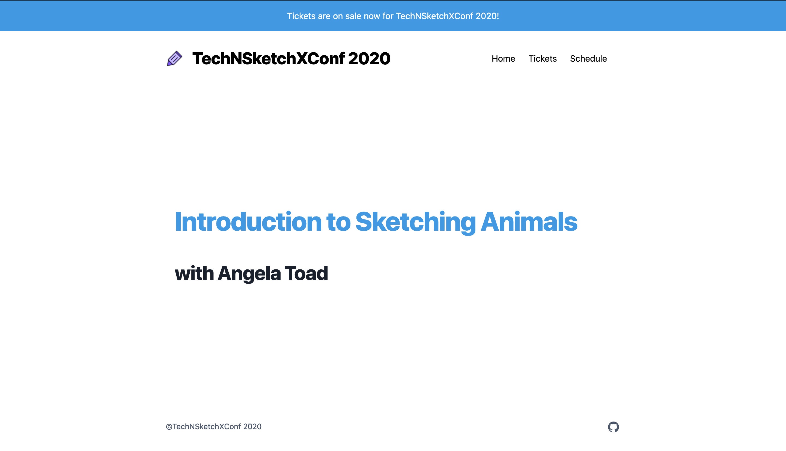

# 08 • Programmatically Generate Speaker Pages

## Background 📚

The `gatsby-node.js` file is a special file that allows developers to programmatically control what data is available in a Gatsby site's GraphQL data layer and how it will be shaped. 
It's often the place where pages, such as blog posts, are programmatically generated or additional fields may be added to the GraphQL schema. `gatsby-node.js` is run once during the process of building your site. Check out https://www.gatsbyjs.com/docs/node-apis/ in order to view the various Node APIs that are available to use in `gatsby-node.js`

We'll be using the [onCreateNode](https://www.gatsbyjs.com/docs/node-apis/#onCreateNode) API to modify the GraphQL data to have a specified URL slug for each talk/speaker and the [createPages](https://www.gatsbyjs.com/docs/node-apis/#createPages) API to actually generate the pages for individual talk/speaker data when the Gatsby site is building. 


Pages created with `createPages` can have specific data available to them via the context object. 
```
createPage({
      path: node.fields.flavor,
      component: path.resolve(`./src/templates/ice-cream.js`),
      context: {
        // Data passed to context is available
        // in page queries as GraphQL variables.
        flavor: node.fields.flavor,
      },
    });
  ```
  
  The above `createPage()` function creates a new page for a given flavor with the `ice-cream.js` template and then passes the `flavor` into the template's context. The template can then construct queries with variables such as the below query which queries icecreamFlavor by flavor and returns the id, flavor, description and nutritionInfo associated with that flavor. 
  
export const query = graphql`
  query IceCreamDescription($flavor: String) {
    mdx(icecreamFlavor: {eq: $flavor}) {
      id
      flavor
      description
      nutritionInfo
    }
  }
`


## Exercise 🤓

- Generate a standalone speaker page for each talk/speaker by creating a `gatsby-node.js` file (starter code below)
- Create a src template at `src/templates/speaker-page.js` that renders the speaker data that is passed into the template from `createPages`

## Preview of Finished Exercise:



## Starter Code

- Add a `gatsby-node.js` file in the root of the site with the following code:
```

const { createFilePath } = require(`gatsby-source-filesystem`);

const path = require(`path`);

// onCreateNode is called when a node is created
// this API allows us to modify nodes during the creation process
exports.onCreateNode = ({ node, getNode, actions }) => {
  const { createNodeField } = actions;

  // we only care about the SpeakersYaml node type where our speaker data is defined
  if (node.internal.type === `SpeakersYaml`) {
    // let's add a new field to the node for the slug
    createNodeField({
      node,
      name: `slug`,
      value: `speaker/${node.name
        .toLowerCase()
        .replace(/[^a-z0-9]+/g, "-")
        .replace(/(^-|-$)+/g, "")}`,
    });
  }
};

// createPages lets us programmatically create pages
exports.createPages = async ({ graphql, actions }) => {
  const { createPage } = actions;
  // lets query to get back all of the slugs that we generated for speaker data
  const result = await graphql(`
    query {
      allSpeakersYaml {
        edges {
          node {
            fields {
              slug
            }
          }
        }
      }
    }
  `);
  // for each speaker that was returned from the above graphql query
  // let's create a new page at it's slug using the speaker-page component
  // the speaker page component has a query that relies on the slug being passed in,
  // we'll pass in the slug via the context parameter in createPage
  result.data.allSpeakersYaml.edges.forEach(({ node }) => {
    createPage({
      path: node.fields.slug,
      component: path.resolve(`./src/templates/speaker-page.js`),
      context: {
        // Data passed to context is available
        // in page queries as GraphQL variables.
        slug: node.fields.slug,
      },
    });
  });
};
```
## Files 🗂

- `src/templates/speaker-page.js`
- `src/gatbsy-node.js`


## Example Solution Code
- [Exercise 8 - Generate Speaker Pages](https://github.com/M0nica/gatsby-workshop/pull/11/files)

## Example Solution Demo
- https://deploy-preview-11--gatsbyjsdemo.netlify.app/

