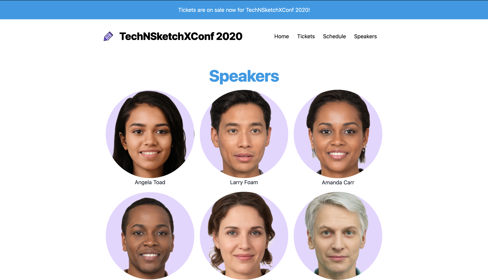

# 11 • Add Speakers Page 

## Background 📚

Let's add a `/speakers` page to the site that displays headshots for each speaker with a link to a page with more information about their individual talk.

## Exercise 🤓
- Add a link to the `/speakers` page which lists all speakers in the navigation
- Update the SpeakerCard to link to the individual talk/speaker page for its speaker
- Create `speaker.js` page which queries for speaker data and renders it using the `SpeakerCard` component 

## Preview of Finished Exercise:

## Files 🗂
- site/src/components/header.js
- site/src/components/speakerCards.js
- site/src/pages/speakers.js

## Example Solution Code
- [Exercise 11: Add Speakers Page ](https://github.com/M0nica/gatsby-workshop/pull/14/files)

## Example Solution Demo
- https://deploy-preview-14--gatsbyjsdemo.netlify.app/

